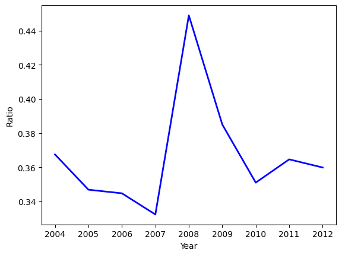
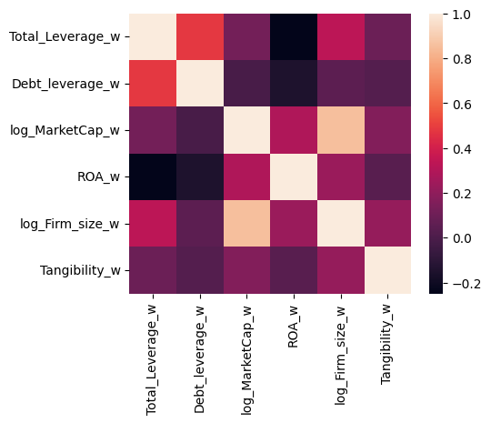
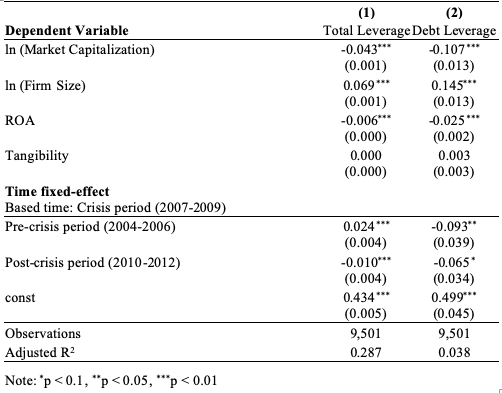
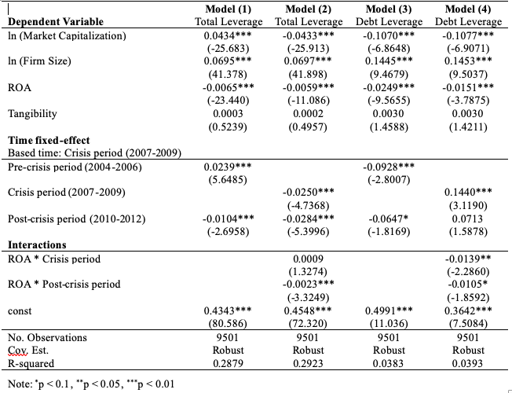

# The Impact of the Financial Crisis 2008 on European Firms’ Capital Structures

This report briefly shows the analysis results that represent the European economy during the Financial Crisis times.

📈 Analyzed time period: 2004 - 2012

👭 Authors: Trang Ton and Quynh Phung

Raw data were extracted from [Osiris Database](https://www.bvdinfo.com/en-gb/our-products/data/international/osiris), which provides information on listed and unlisted firms worldwide, by Bureau van Dijk, a Moody's Analytics Company.

[Python source code](https://github.com/Trang-Ton/FinancialCrisis_DataAnalysis/blob/main/Data%20Analysis.ipynb)

The study is intended to represent the EU economy, hence it includes companies from the Eurozone including 19 out of the 27 EU countries: 

🇦🇹 Austria, 🇧🇪 Belgium, 🇨🇾 Cyprus, 🇪🇪 Estonia, 🇫🇮 Finland, 🇫🇷 France, 🇩🇪 Germany, 🇬🇷 Greece, 🇮🇪 Ireland, 🇮🇹 Italy, 🇱🇻 Latvia, 🇱🇹 Lithuania, 🇱🇺 Luxembourg, 🇲🇹 Malta, 🇳🇱 Netherlands, 🇵🇹 Portugal, 🇸🇰 Slovakia, 🇸🇮 Slovenia, and 🇪🇸 Spain.

### 1. 🔎 Data filters:
✅ publicly traded and non-financial firms

✅ EU firms using Euro currencies

✅ Accounting practice: IFRS - International Financial Reporting Standards

✅ Industry classification based on GICS codes

### 2. Variables:
* Outcomes: leverage ratios
* Predictors: market capitalization, net sales, tangibility, return on assets ratios

*Figure 1 Debt leverage ratios over time 2004 - 2012*

The average debt leverage ratio clearly increased during the crisis years of 2008 and 2009. This implies that during the financial crisis, EU firms had higher debt compared to their assets.

*Figure 2: Correlation heatmap*

### 3. 🔑 Regression models:

Model (1), (2) table 1: OLS regression with time-fixed effect (Crisis period is taken as time-based reference)

*Table 1: OLS regression results*

Model (1), (3) table 2: Panel regression with time-fixed effects (Crisis period is taken as time-based reference). Model (2), (4) table 2: Panel regression with interaction terms of 'ROA * Crisis period'& 'ROA * Post-crisis period'.

*Table 2: Panel regression results*

### 4. 🚀 Implication of results:

💡 Both the OLS and panel regression results reveal a negative association between Leverage Ratio and Market Capitalisation and ROA but a positive relationship between Leverage Ratio and Firm Size. Tangibility appears insignificant to the changes in the Leverage Ratio. 

💡 Most importantly, the financial crisis left huge financial damage on firms, pressuring firms to finance their business with internal funding and equity instead of loans and debts. The capital structure of firms in 19 European countries under study definitely changed post-crisis.

#### 📖 References:
Caselli, S. and Negri, G. (2021) ‘Theoretical foundation of private equity and venture capital, Private Equity and Venture Capital in Europe: Markets, Techniques and Deals (Third Edition), pp. 35-41

Rajan, G.R. and Zingales, L. (1995) ‘What do we know about Capital Structure? Some Evidence from International Data’, The Journal of France, Vol. L, No. 5, pp. 1421-1460

